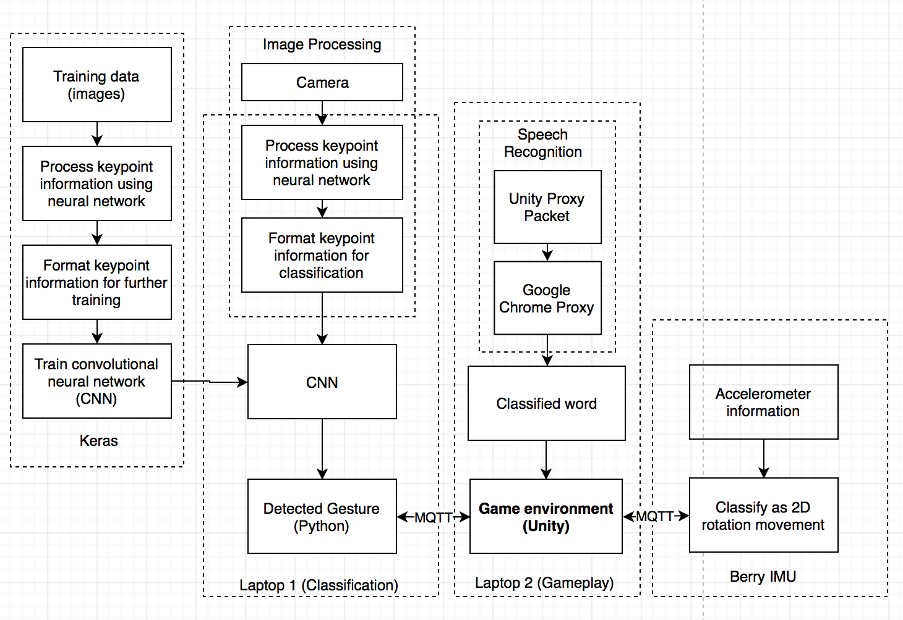

# Sign_The_Alphabet-UCLA_Capstone_Project

Context
The objective of this game is to help the general public learn the American Sign Language (ASL) alphabet in a fun and interactive way. ASL is commonly used in North America and serves as the predominant form of nonverbal language for the hearing impaired. It is also important for those without hearing impairments to learn sign language in order to communicate with and support the deaf community. Our camera-based game interfaces a Unity game environment with machine learning and image processing techniques to allow for human-machine interaction. Users will be able to play interactive mini-games that involve feedback and iterative learning to help them better master the ASL alphabet. Each one of these mini-games will involve a different scenario and task, such as ordering dishes in a restaurant, so as to provide an enjoyable learning experience. 

Figure 1. Block diagram of the entire game system.
We designed our entire game around the idea of using two neural networks to classify ASL gestures. Instead of hand images, we take real time gesture recognition and use key points of the hand extracted from the images to train a neural network. Using this model, we are able to classify most of the letters, except for the similar ones. The image processing techniques involved in recognizing the hand and fingertips include a bounding box, skin tone calibration, and a hand skeleton program. The game is implemented on Unity, and the communication between devices use MQTT communication. IMU control uses Berry IMU, and voice control of the game uses Google Chrome Proxy and on Unity. We were able to achieve a completely hand-free game using voice control in the game mode.
